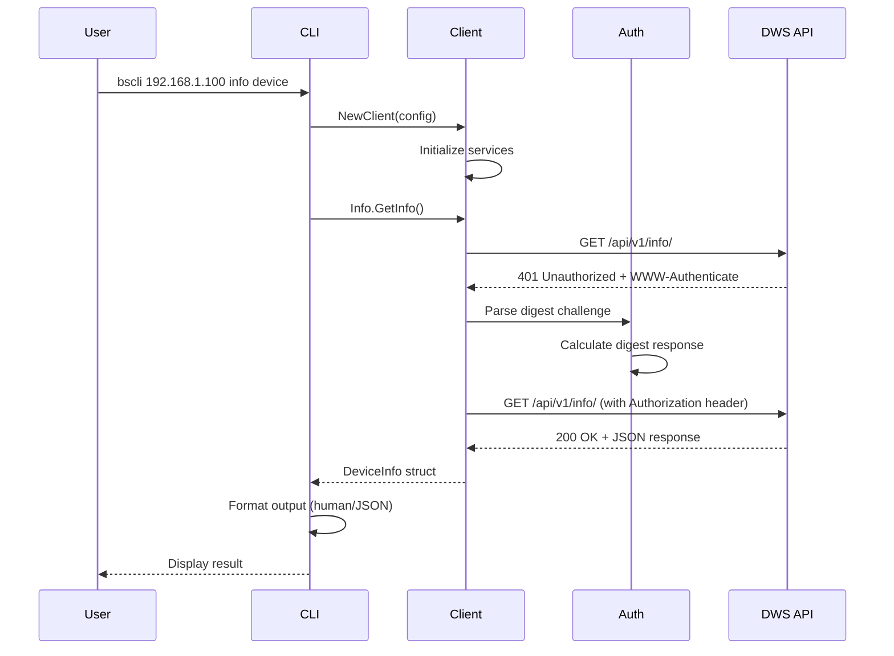

# BrightSign CLI (bscli) Design Document

## Table of Contents
1. [Architecture Overview](#architecture-overview)
2. [Component Design](#component-design)
3. [API Communication Flow](#api-communication-flow)
4. [Authentication](#authentication)
5. [Command Structure](#command-structure)
6. [API Endpoints](#api-endpoints)
7. [Error Handling](#error-handling)
8. [Testing Strategy](#testing-strategy)

## Architecture Overview

The BrightSign CLI (`bscli`) is designed as a modular command-line interface for managing BrightSign digital signage players through their Diagnostic Web Server (DWS) API. The architecture follows a clean separation of concerns with three main layers:

```
┌──────────────────────────────────────────────┐
│              CLI Layer (Cobra)               │
│         /cmd/bscli & /internal/cli           │
├──────────────────────────────────────────────┤
│           Library Layer (Go SDK)             │
│            /pkg/brightsign                   │
├──────────────────────────────────────────────┤
│              HTTP/REST Layer                 │
│         DWS API (Player Hardware)            │
└──────────────────────────────────────────────┘
```

### Key Design Principles

1. **Separation of Concerns**: The CLI interface is completely separated from the business logic
2. **Reusable Library**: The `/pkg/brightsign` package can be used independently as a Go SDK
3. **Service-Oriented**: Each API category (info, control, storage, etc.) has its own service
4. **Flexible Data Handling**: Uses `interface{}` types to handle varying API responses
5. **Dual Output Modes**: Human-readable by default, JSON with `-j/--json` flag
6. **Protocol Flexibility**: Supports both HTTP and HTTPS with self-signed certificates

## Component Design

### 1. CLI Layer (`/cmd/bscli` & `/internal/cli`)

The CLI layer uses the Cobra framework to provide a hierarchical command structure:

```
bscli [host] [command] [subcommand] [args] [flags]
```

**Key Components:**
- `main.go`: Entry point, initializes Cobra
- `cli.go`: Core CLI logic, client initialization
- `*_commands.go`: Command implementations for each service

### 2. Library Layer (`/pkg/brightsign`)

The library provides a clean Go SDK organized by service:

```go
type Client struct {
    config      Config
    httpClient  *http.Client
    Info        *InfoService
    Control     *ControlService
    Storage     *StorageService
    Diagnostics *DiagnosticsService
    Display     *DisplayService
    Registry    *RegistryService
    Logs        *LogsService
    Video       *VideoService
}
```

### 3. Service Architecture

Each service encapsulates related functionality:

```go
type InfoService struct {
    client *Client
}

func (s *InfoService) GetInfo() (*DeviceInfo, error)
func (s *InfoService) GetHealth() (*HealthInfo, error)
func (s *InfoService) GetTime() (*TimeInfo, error)
// ... more methods
```

## API Communication Flow

### Sequence Diagram: Typical Command Execution



## Authentication

The CLI implements RFC 2617 Digest Authentication:

### Authentication Flow

1. **Initial Request**: Send request without authentication
2. **Challenge Response**: Server returns 401 with `WWW-Authenticate` header
3. **Parse Challenge**: Extract realm, nonce, qop, opaque
4. **Calculate Response**: MD5 hash of credentials and challenge
5. **Retry Request**: Send with `Authorization` header

### Example Authentication Headers

**Challenge:**
```http
WWW-Authenticate: Digest realm="brightsign",
    nonce="abc123def456",
    qop="auth",
    opaque="xyz789"
```

**Response:**
```http
Authorization: Digest username="admin",
    realm="brightsign",
    nonce="abc123def456",
    uri="/api/v1/info/",
    qop=auth,
    nc=00000001,
    cnonce="0a4f113b",
    response="6629fae49393a05397450978507c4ef1",
    opaque="xyz789"
```

## Command Structure

### Global Flags

The CLI supports the following global flags:

- `-u, --user string` - Username for authentication (default "admin")
- `-p, --password string` - Password for authentication
- `-d, --debug` - Enable debug output
- `-j, --json` - Output raw JSON (for scripts)
- `-l, --local` - Accept locally signed certificates (use HTTPS with insecure TLS)

### Environment Variables

The CLI supports the following environment variables:

- `BSCLI_TEST_DEBUG=true` - Enable debug output (equivalent to -d flag)
- `BSCLI_TEST_INSECURE=true` - Accept locally signed certificates (equivalent to -l flag)

These environment variables provide consistency with the integration test suite and example programs.

### Command Hierarchy

```
bscli
├── info
│   ├── device
│   ├── health
│   ├── time
│   ├── set-time
│   ├── video-mode
│   └── apis
├── control
│   ├── reboot
│   ├── snapshot
│   ├── dws-password
│   └── local-dws
├── file
│   ├── list
│   ├── upload
│   ├── download
│   ├── delete
│   ├── rename
│   └── mkdir
├── diagnostics
│   ├── run
│   ├── ping
│   ├── dns-lookup
│   ├── traceroute
│   └── interfaces
├── registry
│   ├── get-all
│   ├── get
│   ├── set
│   ├── delete
│   └── search
├── logs
│   ├── get
│   └── supervisor
└── video
    ├── output-info
    └── edid
```

## API Endpoints

### 1. Info Endpoints

#### GET /api/v1/info/
Retrieves basic device information.

**Request:**
```http
GET /api/v1/info/ HTTP/1.1
Host: 192.168.1.100
Authorization: Digest ...
```

**Response:**
```json
{
  "data": {
    "result": {
      "model": "XT1144",
      "serial": "XTC35T000155",
      "family": "Sebring",
      "bootVersion": "8.5.47",
      "fwVersion": "9.1.66",
      "uptime": "3 days, 4:23:45",
      "uptimeSeconds": 276225,
      "network": {
        "interfaces": [
          {
            "name": "eth0",
            "type": "ethernet",
            "proto": "dhcp",
            "ip": "192.168.1.100",
            "netmask": "255.255.255.0",
            "gateway": "192.168.1.1",
            "dns": "8.8.8.8",
            "mac": "90:ac:3f:12:34:56"
          }
        ],
        "hostname": "brightsign-device"
      },
      "extensions": {}
    }
  }
}
```

#### GET /api/v1/health/
Returns player health status.

**Response:**
```json
{
  "data": {
    "result": {
      "status": "healthy",
      "statusTime": "2025-08-26 16:37:37 PST"
    }
  }
}
```

#### GET /api/v1/time/
Gets current time configuration.

**Response:**
```json
{
  "data": {
    "result": {
      "date": 1724707200,
      "time": "12:34:56",
      "timezone": "America/Los_Angeles"
    }
  }
}
```

### 2. Control Endpoints

#### PUT /api/v1/control/reboot/
Reboots the player.

**Request Body:**
```json
{
  "crashReport": false,
  "factoryReset": false,
  "autorun": true
}
```

**Response:**
```json
{
  "data": {
    "result": "rebooting"
  }
}
```

#### POST /api/v1/snapshot/
Takes a screenshot of current display.

**Request Body:**
```json
{
  "width": 1920,
  "height": 1080,
  "shouldCaptureFullResolution": true
}
```

**Response:**
```json
{
  "data": {
    "result": {
      "filename": "/storage/sd/snapshot_20250826_123456.jpg",
      "success": true
    }
  }
}
```

### 3. Storage Endpoints

#### GET /api/v1/files/{path}/
Lists files and directories.

**Request:**
```http
GET /api/v1/files/sd/ HTTP/1.1
```

**Response:**
```json
{
  "data": {
    "result": [
      {
        "name": "autorun.brs",
        "path": "sd/",
        "type": "file",
        "size": 12345,
        "lastModified": "2025-08-26T10:30:00Z"
      },
      {
        "name": "media",
        "path": "sd/",
        "type": "dir",
        "size": 0
      }
    ]
  }
}
```

#### PUT /api/v1/files/{path}/
Uploads a file or creates a directory.

**Request (File Upload):**
```http
PUT /api/v1/files/sd/newfile.txt HTTP/1.1
Content-Type: application/octet-stream

[file contents]
```

**Request (Create Directory):**
```http
PUT /api/v1/files/sd/newfolder/ HTTP/1.1
Content-Length: 0
```

### 4. Diagnostics Endpoints

#### GET /api/v1/diagnostics/
Runs comprehensive network diagnostics.

**Response:**
```json
{
  "data": {
    "result": {
      "network": {
        "interfaces": ["eth0", "wlan0"],
        "internetConnectivity": true,
        "gateway": "192.168.1.1"
      },
      "dns": {
        "servers": ["8.8.8.8", "8.8.4.4"],
        "resolution": "success"
      },
      "services": {
        "bsn": "reachable",
        "ntp": "synchronized"
      }
    }
  }
}
```

#### GET /api/v1/diagnostics/ping/{ipAddress}
Performs ping test.

**Response:**
```json
{
  "data": {
    "result": {
      "address": "8.8.8.8",
      "success": true,
      "packetsSent": 4,
      "packetsRecv": 4,
      "packetLoss": 0.0,
      "minTime": 10.2,
      "avgTime": 12.5,
      "maxTime": 15.1
    }
  }
}
```

### 5. Registry Endpoints

#### GET /api/v1/registry/
Returns entire registry dump.

**Response:**
```json
{
  "data": {
    "result": {
      "networking": {
        "hostname": "player-01",
        "ssh": "disabled"
      },
      "display": {
        "resolution": "1920x1080",
        "orientation": "landscape"
      }
    }
  }
}
```

#### PUT /api/v1/registry/{section}/{key}/
Sets a registry value.

**Request Body:**
```json
{
  "value": "new-value"
}
```

### 6. Logs Endpoints

#### GET /api/v1/logs/
Retrieves serial debug logs.

**Response:**
```json
{
  "data": {
    "result": "[123.456] System boot complete\n[124.567] Network connected\n..."
  }
}
```

#### GET /api/v1/system/supervisor/logging/
Gets supervisor logging level.

**Response:**
```json
{
  "data": {
    "result": {
      "level": 2,
      "description": "info"
    }
  }
}
```

### 7. Video Endpoints

#### GET /api/v1/video/{connector}/output/{device}/
Gets video output information.

**Response:**
```json
{
  "data": {
    "result": {
      "connector": "hdmi",
      "device": "0",
      "connected": true,
      "width": 1920,
      "height": 1080,
      "refreshRate": 60,
      "interlaceMode": "progressive",
      "preferredMode": "1920x1080x60p"
    }
  }
}
```

## Complete Usage Examples

### Example 1: Get Device Information
```bash
$ bscli 192.168.1.100 -p mypassword info device
Model: XT1144
Serial: XTC35T000155
Family: Sebring
Boot Version: 8.5.47
Firmware: 9.1.66
Uptime: 3 days, 4:23:45 (276225 seconds)
Network:
  eth0 (ethernet/dhcp): 192.168.1.100
```

### Example 2: Upload a File
```bash
$ bscli 192.168.1.100 -p mypassword file upload video.mp4 /storage/sd/media/video.mp4
Uploading video.mp4 to /storage/sd/media/video.mp4...
Upload complete
```

### Example 3: Run Network Diagnostics
```bash
$ bscli 192.168.1.100 -p mypassword diagnostics ping 8.8.8.8
PING 8.8.8.8: 4/4 packets received
Packet Loss: 0.0%
RTT min/avg/max = 10.20/12.50/15.10 ms
```

### Example 4: Set Registry Value
```bash
$ bscli 192.168.1.100 -p mypassword registry set networking hostname "player-lobby"
Set networking/hostname = player-lobby
```

### Example 5: Get Logs with JSON Output
```bash
$ bscli 192.168.1.100 -p mypassword --json logs get
"[123.456] System boot complete\n[124.567] Network connected\n[125.789] Starting autorun..."
```

### Example 6: Take a Screenshot
```bash
$ bscli 192.168.1.100 -p mypassword control snapshot --width 1920 --height 1080
Snapshot saved: /storage/sd/snapshot_20250826_143022.jpg
```

### Example 7: Reboot the Player

**Basic Reboot:**
```bash
$ bscli 192.168.1.100 -p mypassword control reboot
Reboot initiated
```

**Reboot with Options:**
```bash
# Generate crash report before reboot
$ bscli 192.168.1.100 -p mypassword control reboot --crash-report
Reboot initiated

# Factory reset (WARNING: This erases all settings!)
$ bscli 192.168.1.100 -p mypassword control reboot --factory-reset
Reboot initiated

# Reboot and disable autorun script
$ bscli 192.168.1.100 -p mypassword control reboot --disable-autorun
Reboot initiated
```

**JSON Output:**
```bash
$ bscli 192.168.1.100 -p mypassword --json control reboot
{"status":"rebooting","timestamp":"2025-08-26T14:30:45Z"}
```

**API Details for Reboot:**

The reboot command sends a PUT request to `/api/v1/control/reboot/` with optional parameters:

```bash
# Behind the scenes HTTP request:
PUT /api/v1/control/reboot/ HTTP/1.1
Host: 192.168.1.100
Authorization: Digest username="admin", realm="brightsign", ...
Content-Type: application/json

{
  "crashReport": false,
  "factoryReset": false,
  "autorun": true
}
```

**Response:**
```json
{
  "data": {
    "result": "rebooting"
  }
}
```

**Important Notes:**
- The player will immediately begin the reboot process
- Network connection will be lost after the command succeeds
- The player typically takes 30-60 seconds to fully reboot
- If `--factory-reset` is used, all settings and files will be erased
- The `--disable-autorun` flag prevents autorun scripts from executing after reboot

## Error Handling

### Error Response Format

All API errors follow a consistent format:

```json
{
  "status": 404,
  "message": "The file resource '/nonexistent/' does not exist."
}
```

### CLI Error Handling

The CLI handles errors at multiple levels:

1. **Network Errors**: Connection failures, timeouts
2. **Authentication Errors**: Invalid credentials, expired sessions
3. **API Errors**: Resource not found, invalid parameters
4. **Parsing Errors**: Malformed JSON responses
5. **TLS Certificate Errors**: Self-signed or locally signed certificates

#### TLS Certificate Error Handling

When the CLI detects a TLS certificate error (common with BrightSign players using self-signed certificates), it provides helpful suggestions:

**Human-readable output:**
```
Error: request failed: Get "https://player.local/api/v1/info/": tls: failed to verify certificate: x509: certificate is not standards compliant

This appears to be a TLS certificate error. The player may be using a self-signed certificate.
Try one of the following:
  1. Use the --local or -l flag to accept locally signed certificates
  2. Set environment variable: export BSCLI_TEST_INSECURE=true
```

**JSON output with -j flag:**
```json
{
  "error": "request failed: Get \"https://player.local/api/v1/info/\": tls: failed to verify certificate: x509: certificate is not standards compliant",
  "suggestion": "This appears to be a TLS certificate error. Try using --local or -l flag, or set BSCLI_TEST_INSECURE=true"
}
```

### Error Output Modes

**Human-Readable Mode:**
```
Error: request failed: Get "http://192.168.1.100/api/v1/info/": connection refused
```

**JSON Mode:**
```json
{
  "error": "request failed: Get \"http://192.168.1.100/api/v1/info/\": connection refused"
}
```

## Testing Strategy

### Unit Tests
- **Package**: `/pkg/brightsign/*_test.go`
- **Coverage**: All service methods, authentication, parsing
- **Approach**: Mock HTTP responses, table-driven tests

### Integration Tests
- **Package**: `/test/integration_test.go`
- **Coverage**: All CLI commands against real hardware
- **Categories**:
  - Info commands
  - File operations
  - Diagnostics
  - Registry management
  - Error handling
  - JSON consistency

### Test Configuration

Integration tests use environment variables:
```bash
BSCLI_TEST_HOST=192.168.1.100
BSCLI_TEST_PASSWORD=password
BSCLI_TEST_USERNAME=admin  # optional
```

### Safety Measures

Integration tests avoid destructive operations:
- No factory resets
- No firmware updates
- Temporary test files are cleaned up
- Test registry keys are removed
- Read-only operations preferred

## Data Structure Flexibility

To handle varying API responses across different BrightSign models and firmware versions, the design uses flexible data structures:

### Flexible Type Handling

```go
// Return interface{} for variable responses
func (s *InfoService) ListAPIs() (interface{}, error)

// CLI handles different types
switch apiList := apis.(type) {
case []string:
    // Handle array of strings
case map[string]interface{}:
    // Handle object format
default:
    // Handle other formats
}
```

### Benefits
- **Compatibility**: Works with different player models
- **Future-Proof**: Adapts to API changes
- **Graceful Degradation**: Falls back to raw output when structure unknown

## Performance Considerations

### Connection Pooling
The HTTP client reuses connections through Go's built-in connection pooling.

### Timeout Configuration
Default timeout of 30 seconds, configurable via client:
```go
client := brightsign.NewClient(brightsign.Config{
    Timeout: 60 * time.Second,
})
```

### Concurrent Operations
Integration tests run independent tests concurrently for faster execution.

## Security Considerations

### Credential Handling
- Passwords never logged or displayed
- Digest authentication prevents password transmission
- No credentials stored on disk

### Network Security
- HTTPS support when configured on player
- Digest authentication with MD5 hashing
- Session management through nonce tracking

## Future Enhancements

1. **WebSocket Support**: For real-time log streaming
2. **Batch Operations**: Process multiple files/commands
3. **Configuration Files**: Store common settings
4. **Plugin System**: Extend functionality
5. **Progress Indicators**: For long-running operations
6. **Caching**: For frequently accessed data